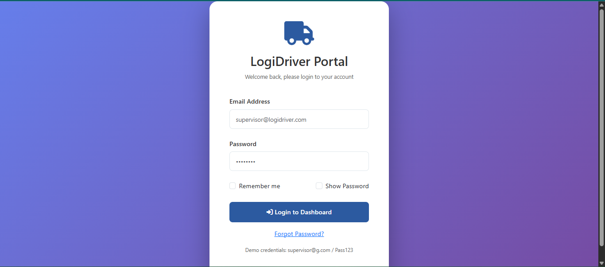
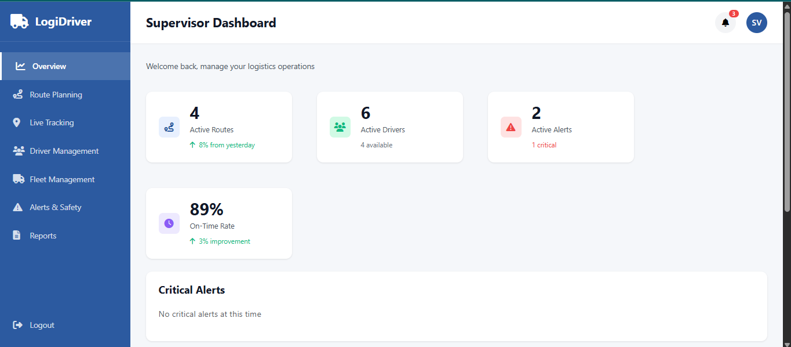
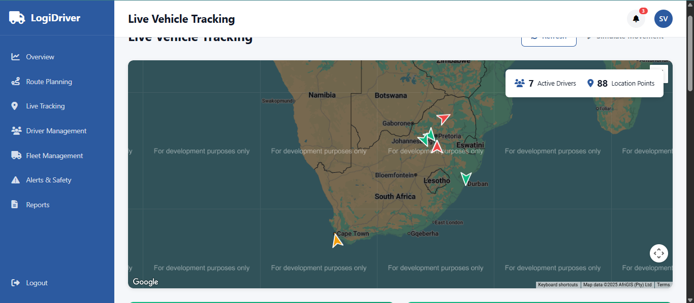
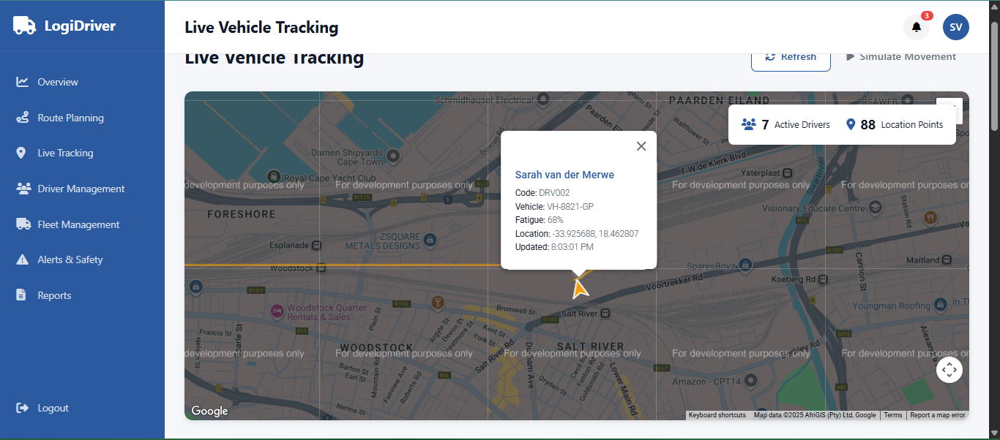
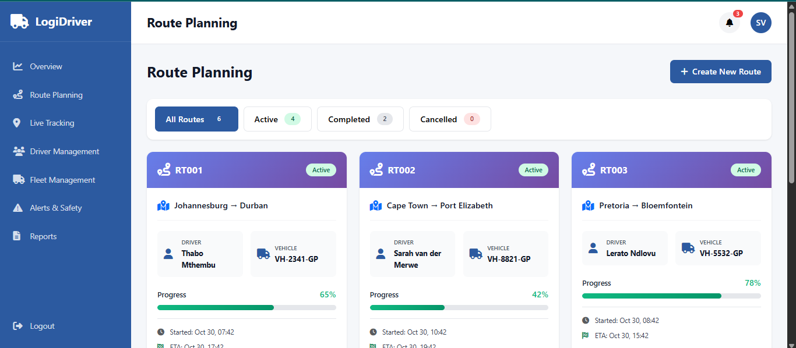
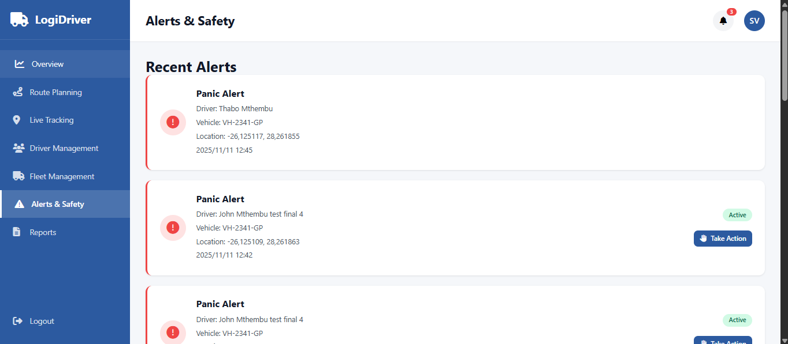
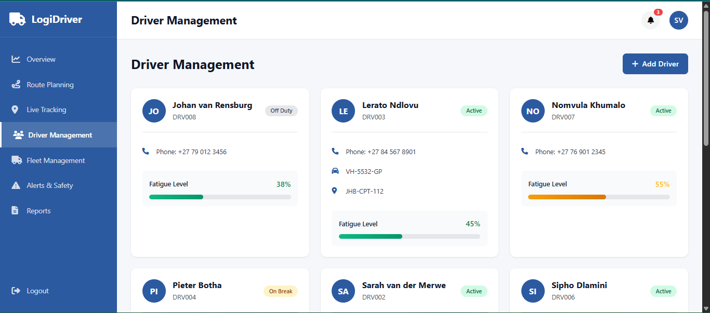
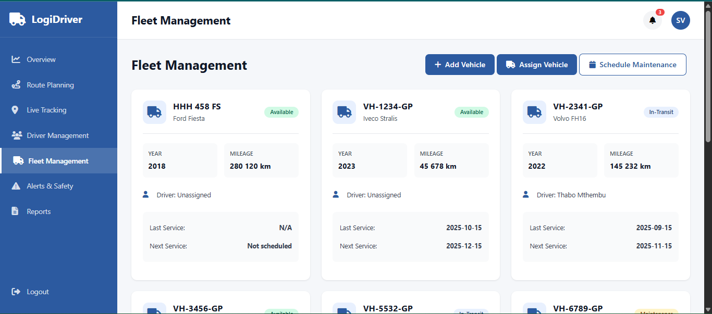

# LogiDriver - Logistics Management & Real-Time Tracking Portal

**LogiDriver** is a professional full-stack logistics management system designed for real-time fleet operations, route optimization, and driver safety monitoring. Built with **ASP.NET Core MVC 7.0** and **MySQL**, the platform empowers supervisors with actionable insights into fleet performance, live GPS tracking, and automated safety alerts.

---

## Key Features

### Real-Time Fleet Tracking
* **Google Maps Integration:** Live vehicle location monitoring with custom markers and polyline route history.

### Intelligent Route Management
* **Smart Planning:** Automated distance calculations between 15+ major South African cities (Johannesburg, Cape Town, Durban, etc.).
* **ETA Predictions:** Intelligent arrival time forecasting based on route distance and vehicle speed.
* **Route Code Generation:** Automated unique identifiers for every logistics trip for easy tracking.

### Driver Safety & Compliance
* **Fatigue Monitoring:** Real-time tracking of driver fatigue levels with color-coded severity indicators.
* **Panic System:** Instant notification system for emergency events and driver incidents.
* **Fleet Administration:** Comprehensive CRUD operations for managing 50+ drivers and vehicles, including maintenance scheduling.

### Analytics Dashboard
* **Operational Metrics:** High-level view of active routes, driver availability, and capacity utilization.
* **Data Visualization:** Responsive charts and summaries of on-time delivery rates.

---

## Screenshots

### 1. Login Page

### 2. Supervisor Dashboard

*The central hub displaying critical operational metrics, active routes, and driver availability.*

### 2. Live GPS Tracking & Maps

*Real-time vehicle movement with polyline history visualization and custom Google Maps markers.*

### 3. Route Planning Interface

*Interface for assigning drivers to vehicles and calculating trip distances between South African cities.*

### 4. Safety Alerts & Notifications

*Automated alert system for panic events, route deviations, and fatigue level warnings.*

### 5. Driver Management

*CRUD features for driver management.*

### 6. Fleet Management

*CRUD features for fleet management.*

---

## 🛠️ Tech Stack

* **Backend:** C# | ASP.NET Core MVC 7.0 | Entity Framework Core
* **Frontend:** Razor Views (CSHTML) | JavaScript (ES6+) | Bootstrap 5 | AJAX | CSS3
* **Database:** MySQL 8.0 (Normalized schema with 10+ tables)
* **APIs:** Google Maps JavaScript API | ASP.NET Identity
* **Tools:** Visual Studio 2022 | Git | RESTful API Design

---

## 📈 Key Achievements
* **Reduced Planning Time:** Cut route planning time by **60%** through automated distance algorithms.
* **Real-Time Efficiency:** Successfully handled 10-second refresh intervals for multiple vehicles with minimal latency.
* **Safety First:** Developed a fully functional fatigue-monitoring algorithm that alerts supervisors based on live driver data.

---

### 👨‍💻 Developers
* Ruan Meyer
* Rickus Botha
* Robert Nkuna
* Rishabh Singh
* Raees Adam Heslop
* Reinhardt Haensel

*Project developed as a comprehensive solution for South African logistics operations.*
